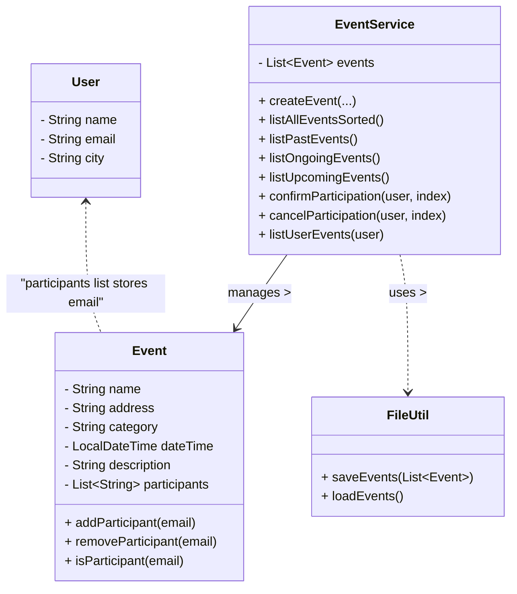

## PROGRAMAÇÃO DE SOLUÇÕES COMPUTACIONAIS - UAM

Projeto em Java para cadastro e inscriçoes em eventos

### Diagrama de Classes

```mermaid
classDiagram
    class User {
        - String name
        - String email
        - String city
    }

    class Event {
        - String name
        - String address
        - String category
        - LocalDateTime dateTime
        - String description
        - List~String~ participants
        + addParticipant(email)
        + removeParticipant(email)
        + isParticipant(email)
    }

    class EventService {
        - List~Event~ events
        + createEvent(...)
        + listAllEventsSorted()
        + listPastEvents()
        + listOngoingEvents()
        + listUpcomingEvents()
        + confirmParticipation(user, index)
        + cancelParticipation(user, index)
        + listUserEvents(user)
    }

    class FileUtil {
        + saveEvents(List~Event~)
        + loadEvents()
    }

    User <.. Event : "participants list stores email"
    EventService --> Event : manages >
    EventService ..> FileUtil : uses >

```
